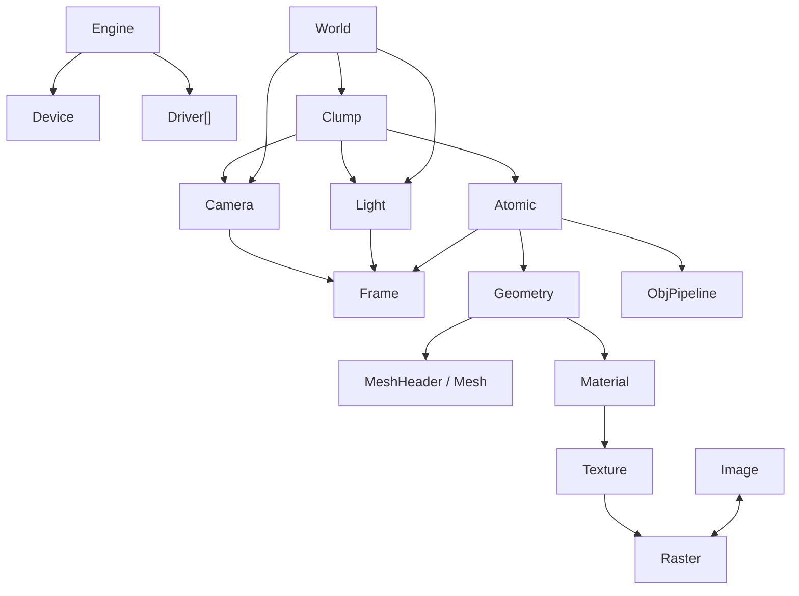

# librw: mapa mental, jerarquia y uso basico

Este documento resume como pensar `librw`, como esta organizado y cual es el flujo minimo para arrancar, renderizar y no perderse entre plugins, pipelines y callbacks.

## 1. Que es librw

`librw` es una reimplementacion parcial de RenderWare Graphics.

No hay que pensarla como un motor moderno "todo en uno", sino como una mezcla de:

- runtime de objetos RenderWare
- sistema de streaming de formatos RW
- backends de render
- capa de plugins para extender estructuras y comportamientos
- pipelines de instanciacion/render relativamente simples

Su estilo es muy de datos y muy de registro previo:

- primero registras plugins
- despues creas/lees objetos
- despues arrancas y renderizas

## 2. Filosofia mental

La mejor forma de pensar `librw` es esta:

- `Geometry` = datos geometricos puros
- `Atomic` = una instancia renderizable de una `Geometry`
- `Frame` = transformacion y jerarquia espacial
- `Clump` = contenedor de atomics, lights y cameras
- `World` = conjunto de clumps y luces activo para render
- `Camera` = framebuffer + zbuffer + matrices + punto de vista
- `Raster` = pixel data dependiente de plataforma
- `Image` = pixel data generica, portable
- `Texture` = wrapper de `Raster` con filtro y addressing
- `Pipeline` = como se instancia y renderiza un atomic
- `Plugin` = extension de estructuras y streaming

En una frase:

`librw` convierte datos RW en objetos RW, y esos objetos terminan siendo dibujados por un backend a traves de pipelines y callbacks.

## 3. Capas principales

Hay tres capas importantes:

### 3.1 Engine

`Engine` controla el ciclo de vida global:

- `init`
- `open`
- `start`
- `stop`
- `close`
- `term`

Tambien contiene:

- un unico `Device` activo para render real
- un array de `Driver`, uno por plataforma soportada

### 3.2 Driver

`Driver` es la capa de plataforma RW, no la API grafica directa.

Su papel mental es:

- convertir `Image <-> Raster`
- manejar formatos nativos de geometria/textura
- proporcionar pipelines por defecto para esa plataforma

### 3.3 Device

`Device` es la capa que realmente dibuja.

Se encarga de:

- arrancar y cerrar el dispositivo
- crear contexto/ventana/render target
- estados de render
- `im2d`
- `im3d`
- llamadas de dibujo reales

## 4. Jerarquia de clases y relaciones

### 4.1 Vista rapida



### 4.2 Jerarquia conceptual

#### Object base

Muchas clases cuelgan de una base muy simple estilo RW:

- `Object`
- `ObjectWithFrame`

No es una jerarquia moderna llena de metodos virtuales.
Es una base de datos compacta con callbacks y plugins alrededor.

#### Frame

`Frame` representa una transformacion en el espacio.

Tiene:

- matriz local
- LTM (`local transformation matrix`) respecto al mundo
- hijos y padre

Y sobre el se enganchan:

- `Atomic`
- `Camera`
- `Light`

Piensalo como el "nodo transform" base.

#### Geometry

`Geometry` contiene los datos renderizables genericos:

- vertices
- normales
- colores
- texcoords
- materiales
- tri indices
- meshes agrupados por material

No tiene posicion propia.

#### Atomic

`Atomic` es la pieza renderizable real.

Tiene:

- referencia a `Geometry`
- `Frame`
- pipeline
- bounding sphere

Si `Geometry` es el "modelo", `Atomic` es la "instancia".

#### Clump

`Clump` es un contenedor RW clasico.

Agrupa:

- atomics
- lights
- cameras

Un DFF normalmente entra como `Clump`.

#### World

`World` es el conjunto que se renderiza a nivel escena.

Contiene:

- clumps
- luces
- camaras

Su `render()` hoy es simple:

- recorre los clumps
- llama a `clump->render()`

#### Camera

`Camera` es mas que una camara logica.

Tambien contiene:

- `frameBuffer`
- `zBuffer`
- matrices de vista/proyeccion
- near/far plane

El flujo clasico es:

- `clear`
- `beginUpdate`
- dibujar
- `endUpdate`
- `showRaster`

#### Material / Texture / Raster / Image

Cadena mental:

- `Image` = datos genericos
- `Raster` = datos dependientes de backend/plataforma
- `Texture` = un `Raster` con sampler state
- `Material` = color + surface props + textura

## 5. Plugins: como pensarlos

Los plugins en `librw` sirven para:

- extender structs con mas datos
- registrar funciones de stream read/write
- enganchar comportamiento adicional

Ejemplos importantes:

- `registerMeshPlugin()`
- `registerNativeDataPlugin()`
- `registerSkinPlugin()`
- `registerMatFXPlugin()`
- `registerHAnimPlugin()`
- `registerUserDataPlugin()`

Regla mental importante:

- los plugins se registran antes de crear o leer objetos de ese tipo

Si no, las estructuras ya no tendran el layout extendido correcto.

## 6. Pipelines: que hacen de verdad

En RenderWare original el concepto de pipeline era muy amplio.
En `librw` esta simplificado.

Un `ObjPipeline` tiene 3 callbacks principales:

- `instance`
- `uninstance`
- `render`

### 6.1 instance

Convierte una `Geometry` generica a representacion eficiente para backend:

- vertex buffers
- index buffers
- vertex declarations
- datos por mesh

### 6.2 render

Hace:

- setup por objeto
- setup de material
- luces/estados
- draw de cada mesh

### 6.3 uninstance

Convierte de vuelta a formato generico.
No siempre es necesario para el camino normal de render.

### 6.4 Pipelines importantes del arbol

- Default
- Skin
- MatFX

## 7. Callback mental map

Hay dos mundos de callbacks:

### 7.1 Callbacks de aplicacion

Los del `skeleton`, via `AppEventHandler`.

Eventos tipicos:

- `INITIALIZE`
- `PLUGINATTACH`
- `RWINITIALIZE`
- `RWTERMINATE`
- `KEYDOWN`
- `KEYUP`
- `MOUSEMOVE`
- `MOUSEBTN`
- `RESIZE`
- `IDLE`

Este es el callback mas importante para una app.

### 7.2 Callbacks internos de engine/pipeline

Son los que usa `librw` por dentro:

- plugins
- pipelines
- render callbacks de atomics
- sync callbacks de objetos con frame

La app normal toca sobre todo el primer grupo.

## 8. Flujo de vida minimo

Si usas el `skeleton`, el flujo mental es este:

### 8.1 Inicializar estado de app

En `INITIALIZE`:

- ancho/alto
- titulo
- flags de app

### 8.2 Adjuntar plugins

En `PLUGINATTACH`:

```cpp
bool attachPlugins(void)
{
    rw::registerMeshPlugin();
    rw::registerNativeDataPlugin();
    rw::registerAtomicRightsPlugin();
    rw::registerMaterialRightsPlugin();
    rw::registerSkinPlugin();
    rw::registerHAnimPlugin();
    rw::registerMatFXPlugin();
    return true;
}
```

### 8.3 Arrancar RW

En `RWINITIALIZE`:

```cpp
bool initRW(void)
{
    if(!rw::Engine::init())
        return false;

    if(!rw::Engine::open(&engineOpenParams))
        return false;

    if(!rw::Engine::start())
        return false;

    return true;
}
```

En el `skeleton` real esto ya viene encapsulado en `sk::InitRW()`.

### 8.4 Crear camera

```cpp
rw::Camera *cam = rw::Camera::create();
cam->setFrame(rw::Frame::create());
cam->frameBuffer = rw::Raster::create(width, height, 0, rw::Raster::CAMERA);
cam->zBuffer = rw::Raster::create(width, height, 0, rw::Raster::ZBUFFER);
cam->setNearPlane(0.1f);
cam->setFarPlane(100.0f);
```

### 8.5 Render loop

En `IDLE`:

```cpp
cam->clear(&clearColor, rw::Camera::CLEARIMAGE | rw::Camera::CLEARZ);
cam->beginUpdate();

// world->render();
// clump->render();
// o rw::im2d / rw::im3d

cam->endUpdate();
cam->showRaster(0);
```

## 9. Dos formas de usar el render

### 9.1 Render de escena RW

Cuando ya tienes objetos RW:

- cargas un `Clump`
- lo configuras
- lo metes en un `World`
- llamas a `world->render()`

Flujo mental:

```cpp
rw::World *world = rw::World::create();
world->addClump(clump);
world->addLight(light);
world->addCamera(camera);

camera->beginUpdate();
world->render();
camera->endUpdate();
camera->showRaster(0);
```

### 9.2 Render inmediato

Si solo quieres dibujar primitivas:

- `rw::im2d` para pantalla/2D
- `rw::im3d` para vertices inmediatos en 3D

#### Im2D

```cpp
rw::RWDEVICE::Im2DVertex verts[3];

rw::SetRenderState(rw::VERTEXALPHA, 1);
rw::SetRenderStatePtr(rw::TEXTURERASTER, nil);

rw::im2d::RenderPrimitive(rw::PRIMTYPETRILIST, verts, 3);
```

#### Im3D

```cpp
rw::RWDEVICE::Im3DVertex verts[3];

rw::im3d::Transform(verts, 3, nil, rw::im3d::EVERYTHING);
rw::im3d::RenderPrimitive(rw::PRIMTYPETRILIST);
rw::im3d::End();
```

## 10. Uso basico de estados de render

No hablas directamente con D3D/OpenGL desde la app.
Hablas con la interfaz comun:

```cpp
rw::SetRenderState(rw::VERTEXALPHA, 1);
rw::SetRenderState(rw::SRCBLEND, rw::BLENDSRCALPHA);
rw::SetRenderState(rw::DESTBLEND, rw::BLENDINVSRCALPHA);
rw::SetRenderStatePtr(rw::TEXTURERASTER, texture->raster);
rw::SetRenderState(rw::TEXTUREFILTER, rw::Texture::LINEAR);
```

Mentalmente:

- la app pide estados genericos
- el `Device` actual los traduce a la API real

## 11. Ejemplo minimo de app mentalmente correcta

```cpp
rw::EngineOpenParams engineOpenParams;
rw::Camera *Camera;

bool attachPlugins()
{
    rw::registerMeshPlugin();
    rw::registerNativeDataPlugin();
    rw::registerSkinPlugin();
    rw::registerMatFXPlugin();
    return true;
}

bool init3D()
{
    if(!rw::Engine::init())
        return false;
    if(!attachPlugins())
        return false;
    if(!rw::Engine::open(&engineOpenParams))
        return false;
    if(!rw::Engine::start())
        return false;

    Camera = rw::Camera::create();
    Camera->setFrame(rw::Frame::create());
    Camera->frameBuffer = rw::Raster::create(1280, 720, 0, rw::Raster::CAMERA);
    Camera->zBuffer = rw::Raster::create(1280, 720, 0, rw::Raster::ZBUFFER);
    Camera->setNearPlane(0.1f);
    Camera->setFarPlane(100.0f);
    return true;
}

void renderFrame()
{
    rw::RGBA clear = { 40, 40, 50, 255 };
    Camera->clear(&clear, rw::Camera::CLEARIMAGE | rw::Camera::CLEARZ);
    Camera->beginUpdate();

    // draw scene or immediate mode here

    Camera->endUpdate();
    Camera->showRaster(0);
}
```

## 12. Donde mirar en el repo

Si quieres aprender `librw` con el menor ruido posible:

- `ARCHITECTURE.MD`
- `src/rwobjects.h`
- `src/rwengine.h`
- `src/rwpipeline.h`
- `skeleton/skeleton.h`
- `skeleton/skeleton.cpp`
- `tools/im2d/main.cpp`
- `tools/playground/main.cpp`

Orden recomendado:

1. `ARCHITECTURE.MD`
2. `src/rwobjects.h`
3. `skeleton/skeleton.cpp`
4. `tools/im2d/main.cpp`
5. `tools/playground/main.cpp`
6. backend concreto (`src/d3d/*` o `src/gl/*`)

## 13. Filosofia final en formato corto

Si te pierdes, vuelve a esta formula:

- los plugins extienden datos
- los frames colocan objetos
- las geometries guardan datos
- los atomics instancian y renderizan
- los clumps agrupan
- el world organiza la escena
- la camera abre y cierra el frame
- el device dibuja
- el driver adapta formatos
- los pipelines convierten y renderizan

Eso es `librw`.
